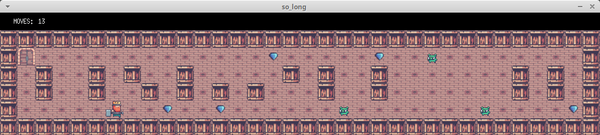

<h1 align="center">
	42cursus' SoLong
</h1>

<p align="center">
	<b><i>Development repo for 42cursus' soLong project</i></b><br>
	For further information about 42cursus and its projects, please refer to <a href="https://github.com/psdiaspedro?tab=repositories"><b>my repo</b></a>.
</p>

# 🗣️ About

This project is a very small 2D game. It is built to work with textures, sprites. And some very basic gameplay elements.

## 🛠️ Compiling
Using Makefile you can create both exe *./so_long* or *./so_long_bonus*
```
make
```
or
```
make bonus
```

## ✏️ Choosing a valid map (see next topic) and running the game

```
./so_long assets/maps/any_map.ber
```
or

```
./so_long_bonus assets/maps_bonus/any_map.ber
```

## 📋 What is a valid .ber map? 
The map needs to be *.ber* format and must include these followings characters:
| character | Descrição                                      |
| --------- | -----------------------------------------------|
| 0         | Free Space |
| 1         | Wall |
| P         | Inicial Player Position |
| E         | Exit |
| C         | Collectible |
| K (bonus) | Enemy |

- The map must be closed/surrounded by walls, if not the program must return an error.
- Map must have at least one exit, one collectible, and one starting position.
- The map must be rectangular.

Game image:


#### More about School 42 you can find here: https://en.wikipedia.org/wiki/42_(school)
